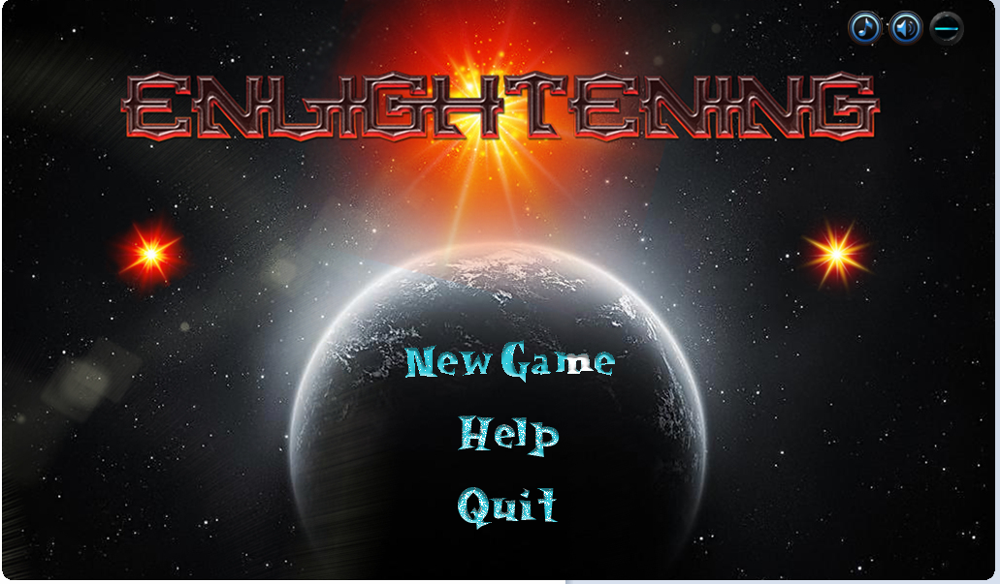
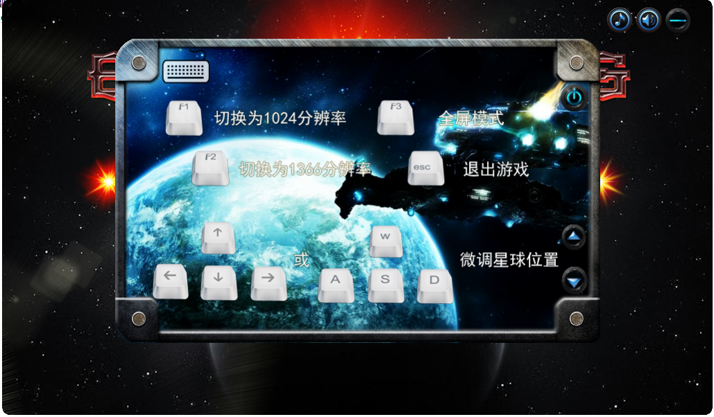
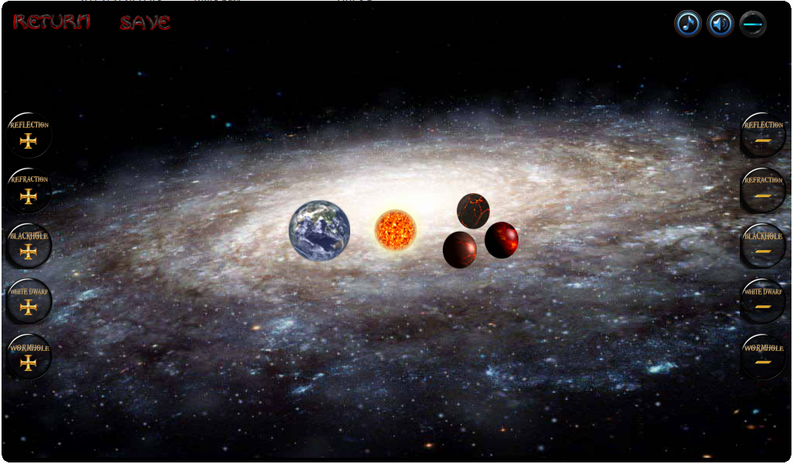

# ELProject
A Java Game Project for Nanjing University Software Engineer Insititute Easy Life Easy Learn Contest
# Project Introduction

Taking Three Body as background, the player can move various planets, which have distinctive functions such as reflection and refraction, to help light reach appointed position. As shown in the figure:

Here is how shortkeys bind:

# Project Features
## The Custom Level

Enlightened by War Craft, we provide a map editor to allow players to customize their own maze.

## Network Share
We provide a platform where players can share their customized map with each other to improve this game's playability.
